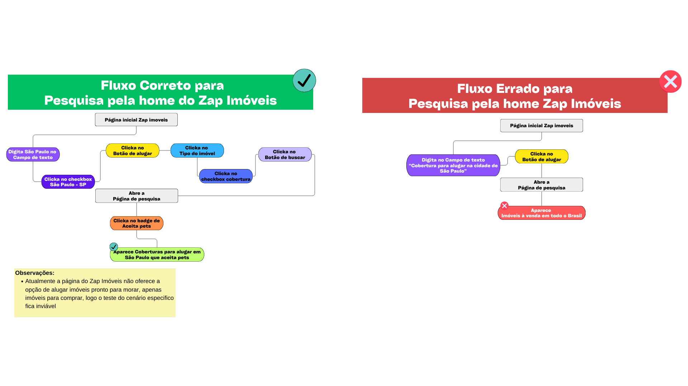
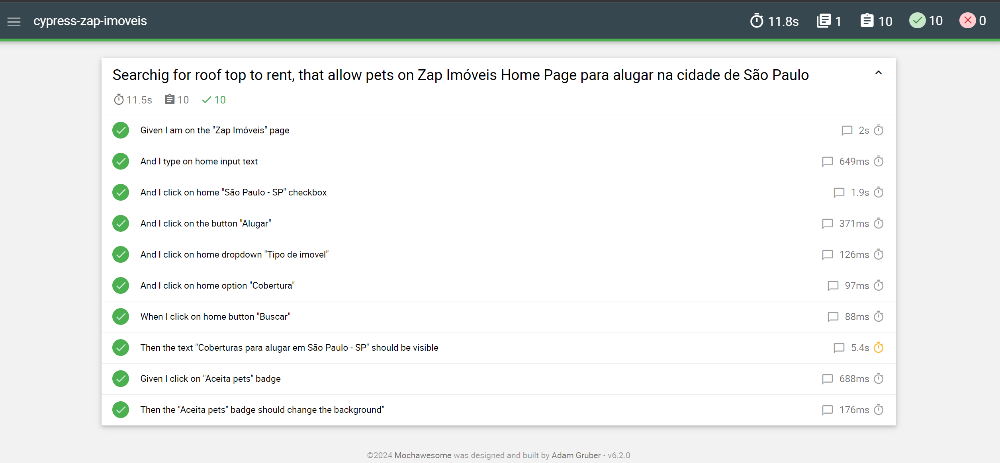
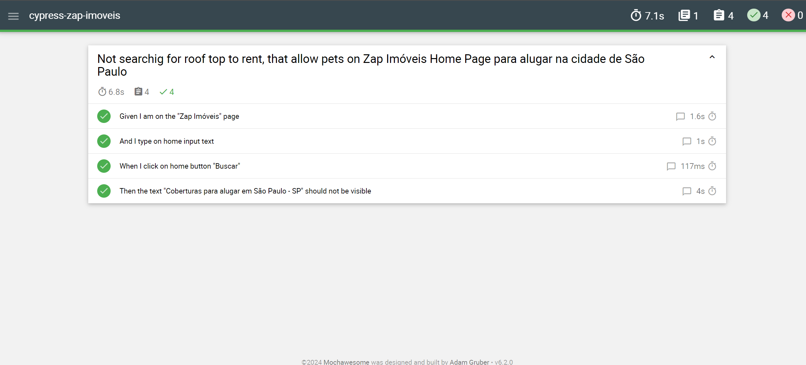

# Case Técnico OLX - Desenvolvimento com foco em Qualidade

[](https://github.com/liara987/CypressZapImovel/actions/workflows/cypress-zap-imoveis.yml)

## Tecnologias
 **v13.12.0**

 **v20.13.1**

## Como testar

Observação: Os testes funcionam apenas quando rodam no **Electron**, caso tente outro browser pode não iniciar os testes

- Tenha o **git** instalado
- Clone o repositório ```git clone https://github.com/liara987/CypressZapImovel.git```
- Acesse a na pasta do projeto no terminal e digite ```cd cypress-zap-imoveis```
- Instale as dependencias ```npm i```
- Rode o comando ```npm run cypress:web```
- Click en **E2E Testing**
- Selecione o navegador **Electron**
- Click em **Start E2E Testing in Electron**
- Click no arquivo **HomePage.cy.js** para testar o caminho de sucesso da pesquisa no site
- Click no arquivo **HomePageFailScenario.cy.js** para testar o caminho de falha da pesquisa no site
- Os testes deven começar a rodar

## Fluxograma


## Cenários Sucesso Testado

- [x] Given I am on the **Zap Imóveis** page
- [x] And I type on home input **São Paulo**
- [x] And I click on home **São Paulo - SP** checkbox
- [x] And I click on the button **Alugar**
- [x] And I click on home dropdown **Tipo de imovel**
- [x] And I click on home option **Cobertura**
- [x] When I click on home button **Buscar**
- [x] Then the text **Coberturas para alugar em São Paulo - SP** should be visible
- [x] Given I click on **Aceita pets** badge
- [x] Then the **Aceita pets** badge should change the background

## Cenários Falho Testado

- [x] Given I am on the **Zap Imóveis** page
- [x] And I type on home input **Cobertura para alugar na cidade de São Paulo**
- [x] When I click on home button **Buscar**
- [x] Then the text **Coberturas para alugar em São Paulo - SP** should **not** be visible

## Relatórios

### Cenário sucesso

#### Imagem


---

### Cenário falho

#### Imagem



